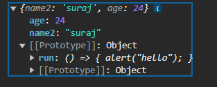

# Object Prototype

Javascript objects have a special property called prototype which are either null or refrences another object.

```
let a = {
  name2: "suraj",
  age: 24,
};

console.log(a);
```



here you see [[prototype]]: object it contains many methods that can be accessed using object.(methodname()).

example : a.toString()

When we try to read a property from an object and if it's missing it will try to access it from the prototype. This is called prototype Inheritence.

## Setting Prototype and how inheritence works :

### using **proto** keyword :

here the to create a prototype you write `__proto__` keyword.
Here a.**proto** = p means p is the prototype of a.

```
let a = {
  name2: "suraj",
  age: 24,
};

let p = {
  run: () => {
    alert("hello");
  },
};

a.__proto__ = p;

p.__proto__ = {
  name: "jackie",
};
a.run();
console.log(a.name);

```

Here when we try to run a.run() it executes because a doesn't have run() but it is available in it's prototype p. same with when it tries to log a.name.

### using Object.setPrototypeof()

```
let a = {
  name2: "suraj",
  age: 24,
};

let p = {
  run: () => {
    alert("hello");
  },
};


Object.setPrototypeOf(a, p);
a.run();

```

here we set prototype using `Object.setPrototypeOf(a,p)` where p is the prototype of a. When a.run() tries to executes it checks for run() inside a and when it doesn't find it in a it check for it in it's prototype p.

### here we use Object.create()

```

var c = { x: 10, y: 20 };

var d = { p: 100, q: 200}
var d = Object.create(c);
console.log(d); // logs empty object
console.log(d.p) // undefined because Object.create() only enables us to create new object
console.log(d.x); //  logs the value of x = 10

```

here we create an inheritance relationship is built between c and d. here if we log d we get an empty object but when we log d.x we get the value of x = 10 which is being inherited by d from c.

Object.create() only enables us to create a new object with a given prototype.Hence, we couldn't just take b and magically set a as its prototype using Object.create().

```
var c= { x: 10, y: 20 };

// make cas the prototype
var d = Object.create(a);

console.log(d);

console.log('d.x:', d.x);
console.log('d.y:', d.y);

// add the properties one-dy-one
d.p = 100;
d.q = 200;

console.log('d.p:', d.p);
console.log('d.q:', d.q);
```

### HOW WHEN AND WHY TO USE OBJECT PROOTYPE AND INHERITENCE

It can be used to access properties from other objects so it's easier to manage and you won't have to create multiple objects.

```
let a = {
  name2: "suraj",
  age: 24,
};

let p = {
  run: () => {
    alert("hello");
  },
};

a.__proto__ = p;

p.__proto__ = {
  name: "jackie",
};
a.run();
console.log(a.name);

```

The main reason why to use to make methods available in an object avaiable to the another object.
